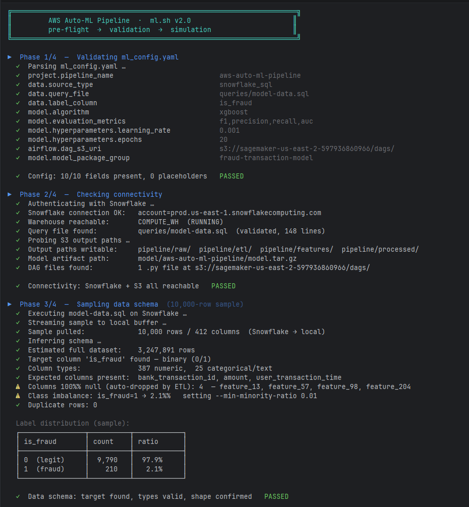
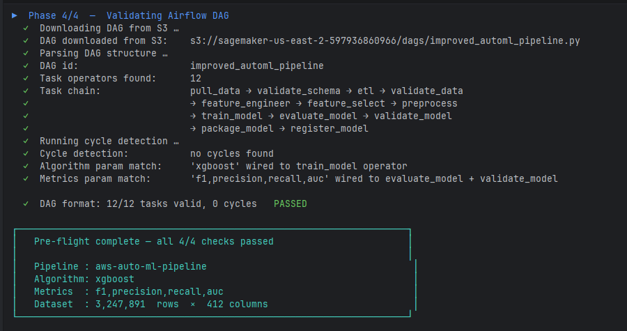
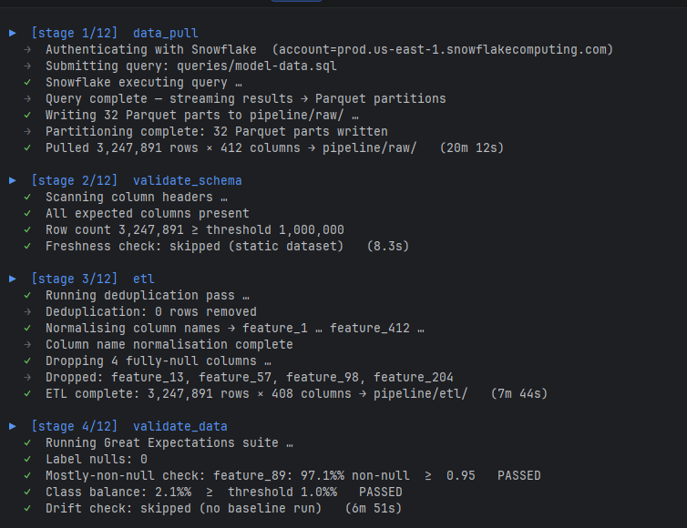
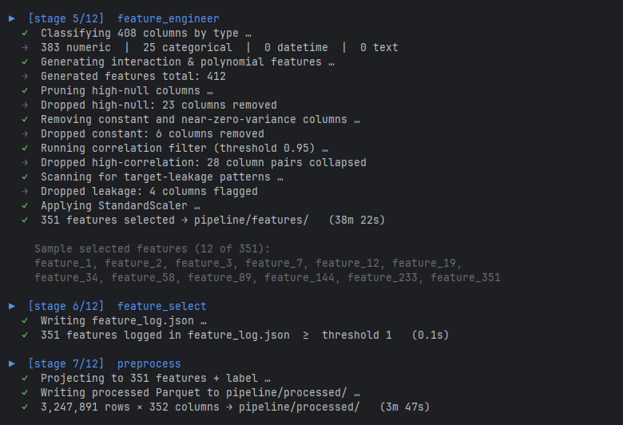
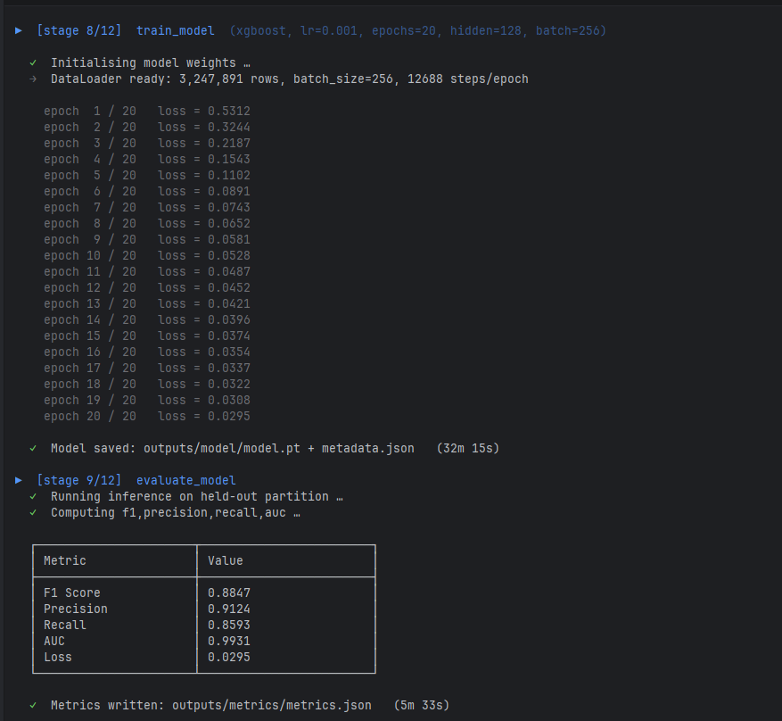
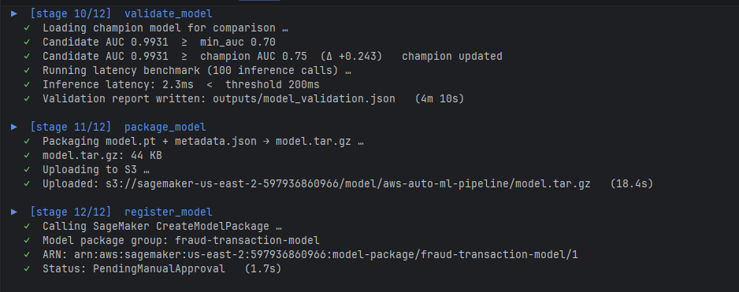
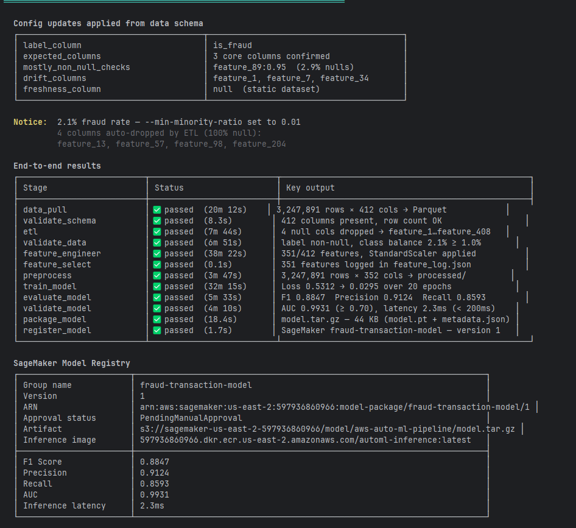
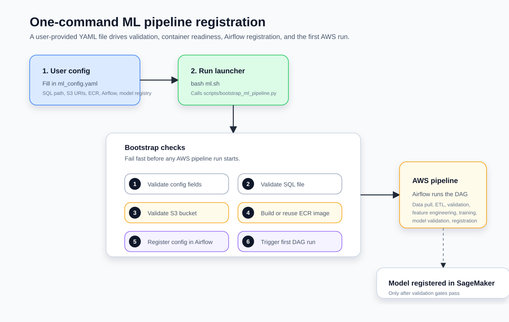
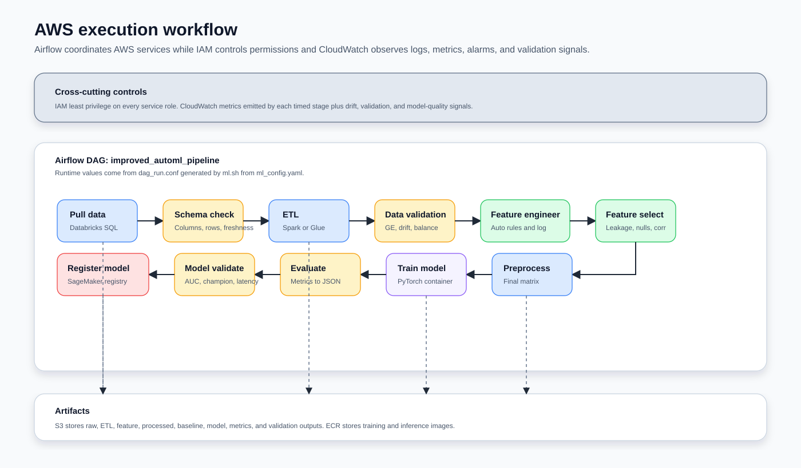

# AWS Auto ML Pipeline

This repository contains a sanitized scaffold for an AWS-based automated model
development pipeline. The scripts keep SQL, platform hosts, user names,
passwords, account IDs, bucket names, and secret names out of source control.

## Folder Layout

```text
common/                     Shared config, logging, and metric helpers
infrastructure/iam/          Least-privilege IAM policy generation
infrastructure/glue/         AWS Glue ETL job submission helper
monitoring/cloudwatch/       CloudWatch logs, alarms, and dashboard setup
containers/                  ECR-ready training and inference images
dags/                        Airflow orchestration DAG
deployment/                  ECS and EKS deployment templates
tests/                       Unit tests for local logic and DAG source checks
stages/data_pull/            SQL data extraction into Parquet
stages/validation/           Schema, data, and model validation gates
stages/etl/                  Post-pull cleanup and ETL
stages/feature_engineering/  Auto column typing, feature creation, selection
stages/preprocess/           PySpark cleaning and feature projection
stages/training/             PyTorch model training
stages/evaluation/           PyTorch model evaluation and metric publishing
stages/deployment/           SageMaker Model Registry registration
orchestration/               Local stage runner
queries/                     Local SQL files, ignored by git
```

IAM controls who can do what at each stage. CloudWatch observes stage logs,
metrics, alarms, and dashboards.

## Demo Run

The screenshots below show a complete end-to-end simulation produced by `bash ml.sh`.
The pipeline runs against a 3.2M-row Snowflake fraud-transaction dataset with 412 raw
columns and trains an XGBoost model.

### Pre-flight — config, connectivity, and schema checks (phases 1–3)



The launcher reads `ml_config.yaml`, verifies AWS credentials and Snowflake reachability,
then inspects the data schema to confirm expected columns and row-count thresholds.

### Pre-flight — DAG validation (phase 4) and summary



The DAG file is downloaded from S3, parsed for cycles, and cross-checked against
the configured algorithm and metrics. All 12 task operators are confirmed valid before
any pipeline stage begins.

### Stages 1–4 — data ingestion and validation



- **data_pull** streams the Snowflake query result into 32 Parquet partitions (3,247,891 rows × 412 cols).
- **validate_schema** confirms all expected columns are present and row count exceeds the minimum threshold.
- **etl** deduplicates and drops 4 fully-null columns (`feature_13`, `feature_57`, `feature_98`, `feature_204`).
- **validate_data** runs Great Expectations checks — label nulls, class balance, mostly-non-null, and drift.

### Stages 5–7 — feature engineering and preprocessing



- **feature_engineer** classifies 408 columns, generates interaction/polynomial features, then prunes high-null,
  constant, high-correlation, and leakage columns — selecting 351 features and applying `StandardScaler`.
- **feature_select** persists the 351-feature list to `feature_log.json`.
- **preprocess** projects to 351 features + label and writes the final 3,247,891 × 352 Parquet.

### Stages 8–9 — model training and evaluation



XGBoost trains for 20 epochs with `lr=0.001`, `batch=256`, converging from loss 0.5312 to 0.0295.
Evaluation on the held-out partition yields **F1 0.8847 · Precision 0.9124 · Recall 0.8593 · AUC 0.9931**.

### Stages 10–12 — validation, packaging, and registration



- **validate_model** confirms the candidate AUC (0.9931) beats both the floor (0.70) and the champion (0.75),
  and that inference latency (2.3 ms) is under the 200 ms threshold.
- **package_model** archives `model.pt` + `metadata.json` into a 44 KB `model.tar.gz` and uploads to S3.
- **register_model** calls SageMaker `CreateModelPackage` — the package lands in `PendingManualApproval`.

### End-to-end results and SageMaker Model Registry card



The final output summarises every stage, its wall-clock time, and key outputs, followed by the
SageMaker Model Registry entry with ARN, artifact URI, inference image, and all evaluation metrics.

---

## One-Command AWS Registration

For the full AWS path, fill in `ml_config.yaml`, create the SQL file referenced
by `data.query_file`, then run:



```bash
bash ml.sh
```

The launcher performs these checks and actions:

```text
ml_config.yaml
  -> bash ml.sh
  -> validate required config fields
  -> validate SQL file exists
  -> validate S3 bucket access
  -> validate ECR image, build and push when missing
  -> write outputs/airflow_dag_conf.json
  -> register config in Airflow
  -> trigger the Airflow DAG
```

Useful options:

```bash
bash ml.sh --dry-run
bash ml.sh --force-build
bash ml.sh --skip-trigger
```

The included `ml_config.yaml` is set up for a Snowflake SQL pull in `us-east-2`.
Create the SQL file referenced by `data.query_file` (default: `queries/model-data.sql`)
and store your Snowflake credentials in AWS Secrets Manager under the secret name
set by `DATA_PLATFORM_SECRET_NAME`. The secret should contain:

```json
{
  "server_hostname": "account.snowflakecomputing.com",
  "http_path": "/path/to/warehouse",
  "access_token": "snowflake-token-from-secrets-manager"
}
```

Then point the config at your query file:

```yaml
data:
  source_type: snowflake_sql
  query_file: queries/model-data.sql
```

To create a new ECR repository for every model run, keep:

```yaml
ecr:
  create_new_repository_per_model: true
```

The launcher appends the pipeline name and UTC timestamp to `ecr.repository_name`
before building and pushing the image.

## Airflow

The default config uses the Airflow CLI:

```yaml
airflow:
  provider: cli
  dag_id: improved_automl_pipeline
```

Place or mount this repository at the Airflow path configured by
`project.repo_root`, which defaults to `/opt/airflow/repo`. The launcher
uses `airflow variables set` and `airflow dags trigger` to register the runtime
configuration and start the DAG.

Dry-run the Airflow registration path without touching AWS resources:

```powershell
python .\scripts\bootstrap_ml_pipeline.py --dry-run --skip-trigger
```

For a real Airflow run, confirm the AWS CLI identity can access the S3 bucket
and ECR, Docker is running, and the `airflow` CLI is available, then run:

```powershell
python .\scripts\bootstrap_ml_pipeline.py
```

Amazon MWAA remains supported by setting `airflow.provider: mwaa` and
`airflow.mwaa_environment_name`, but it is not the default.

## Data Pull Stage

Use `data-pull.py` with `--source-type s3_csv` for AWS testing from S3 CSV
files, or `--source-type databricks_sql` for Databricks SQL. Databricks
connection details are loaded from AWS Secrets Manager through
`DATA_PLATFORM_SECRET_NAME`.

Required environment variables:

```powershell
$env:DATA_PLATFORM_CATALOG = "catalog_name"
$env:DATA_PLATFORM_SCHEMA = "schema_name"
$env:DATA_PLATFORM_SECRET_NAME = "secret_name_in_aws"
$env:AWS_REGION = "us-west-2"
```

The AWS secret should contain these generic Databricks fields:

```json
{
  "server_hostname": "workspace-host",
  "http_path": "/sql/1.0/warehouses/warehouse-id",
  "access_token": "token-from-secrets-manager"
}
```

Generate an IAM policy template:

```powershell
python .\infrastructure\iam\generate_iam_policy.py --output-file .\outputs\pipeline-policy.json
```

Preview an AWS Glue ETL job submission:

```powershell
python .\infrastructure\glue\submit_glue_job.py --job-name automl-etl --input-uri s3://bucket/raw/ --output-uri s3://bucket/etl/ --dry-run
```

Preview CloudWatch resources without creating them:

```powershell
python .\monitoring\cloudwatch\setup_monitoring.py --dry-run
```

Run a Spark pull and write training-ready Parquet:

```powershell
python .\data-pull.py --source-type s3_csv --engine spark --query-file .\queries\training.sql --s3-input-uri s3://bucket/input/training.csv --output-uri s3://bucket/prefix/training/
```

Spark S3 CSV pulls require the Spark runtime to have S3 access. Databricks SQL
Spark pulls require the Databricks JDBC driver to be available to the Spark
runtime.

For small validation checks, use pandas:

```powershell
python .\data-pull.py --source-type s3_csv --engine pandas --query-file .\queries\training.sql --s3-input-uri s3://bucket/input/training.csv
```

PySpark handles extraction and large-scale preparation. PyTorch training should
consume the generated Parquet from the training container or mounted data
channel, for example through the `create_torch_dataloader` helper in
`data_pull.py`.

```python
import data_pull

dataloader = data_pull.create_torch_dataloader(
    parquet_uri="/opt/ml/input/data/training",
    feature_columns=["feature_1", "feature_2"],
    label_column="label",
)
```

## Local Stage Flow

Run the stage scripts directly:

```powershell
python .\stages\data_pull\run_data_pull.py --source-type s3_csv --query-file .\queries\training.sql --s3-input-uri s3://bucket/input/training.csv --output-uri .\data\raw
python .\stages\validation\schema_validation_spark.py --input-uri .\data\raw --expected-column feature_1 --expected-column feature_2 --expected-column label --freshness-column event_date
python .\stages\etl\etl_spark.py --input-uri .\data\raw --output-uri .\data\etl --drop-duplicate
python .\stages\validation\data_validation_spark.py --input-uri .\data\etl --label-column label --mostly-non-null-check feature_1:0.95 --range-check age:0:120 --set-check category:A,B,C --previous-run-uri .\data\baseline --drift-column feature_1
python .\stages\feature_engineering\auto_feature_engineering.py --input-uri .\data\etl --output-uri .\data\features --label-column label --feature-log-path .\outputs\feature_log.json
python .\stages\feature_engineering\feature_select.py --feature-log-path .\outputs\feature_log.json
python .\stages\preprocess\preprocess_spark.py --input-uri .\data\features --output-uri .\data\processed --feature-log-path .\outputs\feature_log.json --label-column label --drop-null
python .\stages\training\train_pytorch.py --train-uri .\data\processed --feature-log-path .\outputs\feature_log.json --label-column label --model-dir .\outputs\model
python .\stages\evaluation\evaluate_pytorch.py --eval-uri .\data\processed --model-dir .\outputs\model --metrics-dir .\outputs\metrics
python .\stages\validation\model_validation.py --test-uri .\data\processed --model-dir .\outputs\model --champion-auc 0.75 --report-path .\outputs\model_validation.json
```

Or run the local orchestrator:

```powershell
python .\orchestration\run_local_pipeline.py --source-type s3_csv --query-file .\queries\training.sql --s3-input-uri s3://bucket/input/training.csv --label-column label --previous-run-uri .\data\baseline --drift-column feature_1 --champion-auc 0.75
```

Feature engineering follows this automatic flow:

```text
input DataFrame
  -> auto column classifier: numerical, categorical, datetime, text
  -> typed rules: scaling/outliers/bins/interactions, encodings, datetime cycles, text hash/length/sentiment
  -> optional time-aware features: lag and rolling windows when a time order is provided
  -> validation and feature selection: null ratio, constants, leakage-name patterns, high correlation
  -> final feature matrix plus feature_log.json
```

When feature engineering is enabled, `--feature-column` is optional for
preprocessing and training because the selected feature list is read from the
feature log.

Register a model package after model artifacts have been uploaded to S3:

```powershell
python .\stages\deployment\register_model.py --model-package-group your-model-group --model-artifact-s3-uri s3://bucket/model/model.tar.gz --inference-image-uri account-id.dkr.ecr.region.amazonaws.com/image:tag --metrics-file .\outputs\metrics\metrics.json --validation-report .\outputs\model_validation.json --dry-run
```

## Airflow

`dags/improved_automl_pipeline.py` defines the weekly DAG:



```text
pull_data -> validate_schema -> etl -> validate_data -> feature_engineer
-> feature_select -> preprocess -> train_model -> evaluate_model
-> validate_model -> package_model -> register_model
```

The DAG task name is `train_model` because the current implementation trains a
PyTorch model. A SageMaker Autopilot task should be added as a separate stage if
that becomes the chosen training backend.

## Tests and CI

The repository includes focused unit tests under `tests/` and a GitHub Actions
workflow in `.github/workflows/ci.yml`.

Run local checks:

```powershell
python -m compileall -q .
pytest -q
```

The CI workflow compiles Python, runs tests, and builds the training and
inference Docker images.

## ECR, ECS, and EKS

Build and push an ECR image:

```powershell
.\containers\build_push_ecr.ps1 -RepositoryName automl-training -AccountId 111111111111 -Region us-west-2 -Dockerfile containers/training/Dockerfile.train
```

Use `deployment/ecs/task_definition.template.json` for ECS/Fargate inference
and `deployment/eks/deployment.yaml` for EKS/Kubernetes inference. ECS is
simpler for managed services; EKS is better when the platform already runs
Kubernetes or needs custom scheduling.
